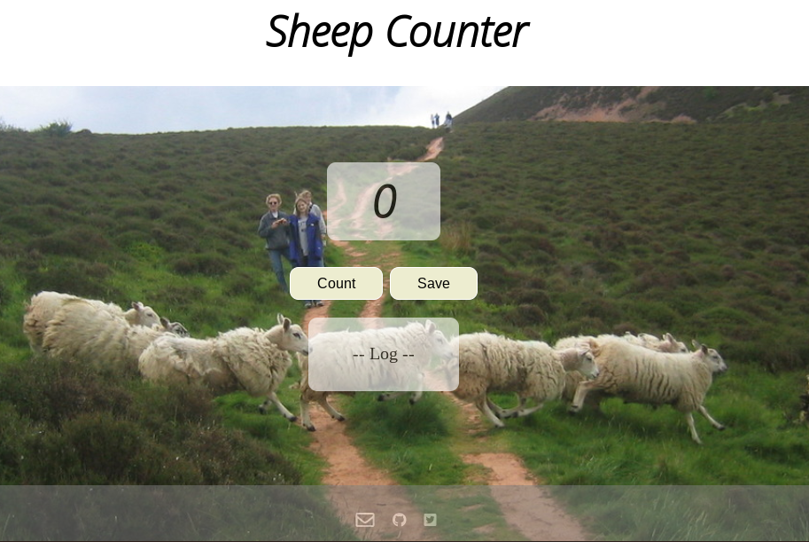

# ONLY FOR REAL CODE NEWBIES 🤓 
## ASK TO BE ASSIGNED THE ISSUE YOU WANT TO WORK ON 🙋

# SheepCounter_JS_HTML_CSS_CodeNewbies
This is a repository for Code Newbies. The tasks are very simple 🙂 , this is just to help newbies get started.

We want to create a Sheep Counter 🐑 that looks like this: 

# TASKS ✔️

Each file has some tasks to complete:
1. **CSS stylesheet**: Feel free to modify the design as you like **BUT** keep the color palette.🎨
2. **JS**: Complete the tasks 🗒️
3. **HTML**: This file is a mess!! 😵‍ Please make it more readable. 
4. Improve this **readme** file.📝
